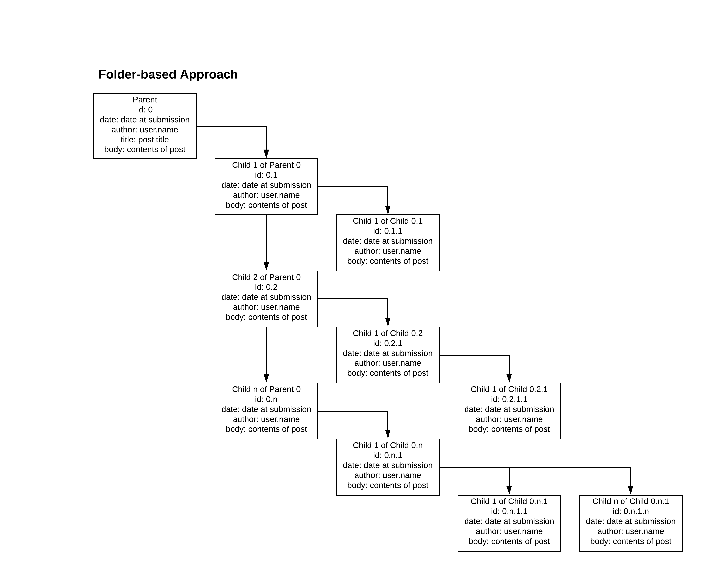

# Webay Forum

## Documentation

### Reference Diagrams

The following are various options for structuring forum data. 

# Webay Forum Proprosal

## 1. Introduction

### Project Description

<!-- Provide a project description. -->
Webay Forum is a user forum for the Webay webstore. 

### Purpose

<!-- Provide a purpose. -->

## 2. Background/Related studies

### Background Knowledge Leading to Inspiration

<!-- Provide background here. -->

[Webay Backend](https://github.com/MiguelAgueda/Webay-Backend)
[Ebay Community Forum](https://community.ebay.com/)

### Summaries and Notes from Sources

<!-- Provide notes here. Images of handwritten notes will work. -->

## 3. Methods

### Your implementation plan (e.g., using open-source libraries or algorithms that you've found from research articles):

<!-- Provide an implementation plan. -->

### Other Sources

<!-- 
Provide all sources here as soon as refrenced. 
Format: [Text to display](www.Link_to_source_here.com) 
-->

## 4. Implementation

### How you implemented your project.

<!-- Describe general implementation. -->

### Program Use Cases

<!-- Provide screenshots of program in action. -->

## 5. Discussion

### Challenges Faced

<!-- Describe challenges. Why was it a challenge? -->

### Overcoming Challenges

<!-- How were the challenges mentioned, resolved? -->

### Stories to Share

<!-- Anything to share with class? -->

## 6. Conclusion

### Lessons Learned

<!-- Lessons about processes, programming, working in a group, et. -->

### Using This Project Experience as Leverage

<!-- How will this project help you get to the next level? -->

## 7. Reference

[Webay](https://github.com/MiguelAgueda/Webay)

[Webay Backend](https://github.com/MiguelAgueda/Webay-Backend)
